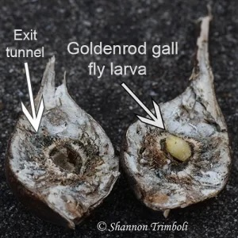
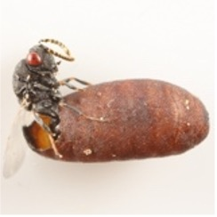

```{r setup, include=FALSE}
knitr::opts_chunk$set(echo = TRUE)
```

## Everything in R is in RAM memory

## Functions to manage your session

```{r}
## install.packages ("ggplot2") ## I don't run this code
getwd() # where does R save/retrieve files? 
dir() # What files are there ?
setwd("/Users/linyizhang/Desktop/Teaching/2024 fall Data analysis in R/Data-analysis-in-R") # Set another place to save/retrieve files
ls() # What is in the current environment ?
# install.packages("ggplot2")
library(ggplot2) ### load a package ###
save.image("lecture2.RData")
?plot # Open the help file for function
??ddply  # Search for a term across
```

#### Q: Install and load the package that have the function "ddply", show the help page for function ddply

## Data types in R

### Logical: TRUE, FALSE

```{r}
3>0
3>5
```

### Numeric: 5,4,0

```{r}
5
4
```

### Character: "one","two","yes"

```{r}
"yes"
```

### variables

Variables are boxes You can put things in (use: \<- or =) You can use the box without knowing what is in it

```{r}
variables<-1.5
can      <-c(TRUE,FALSE)
have     <-c(1,2,3,4)
many     <-c("yes","no")
names    <-1.5

v1<-"yes"
v1<-2
```

#### Q: What is v1 now?

### Vector

```{r}
v1<-c(1,3,5,-2) ### numeric vector
v2<- c ("one", "two", "three","four") # Character vector
v3 <- c ("one ", "two ", "three ","four ") # Character vector
v4<-c(TRUE,TRUE,FALSE,TRUE)
1:10 # a string of continuous numbers with intervals =1

v1[1]
v2[2]
v3[2]

## what about getting first and third number from a vector ##
v1[c(1,3)]
## what about getting first, second and  third number from a vector? ##
v1[c(1,2,3)]

## use logical vectors as indexes 
v1==3
v1[v1==3]
v1>0
v1[v1>0]

v1<0
v1[v1<0]

v2[v2=="one"]
v2[v2!="one"]

v1[v1!=2]

v1[v1<0 |v1>3] ### | stands for or 
v1[v1<0 & v1>3] ### & stands for and

v1[v1 %in% c(1,5)] ### %in%: include multiple values ## 

```

#### Q: How to create a numeric vector with intervals =2 ?

seq(1,10,3)

#### Hint: use function "seq"

### Factor

```{r}
v11<-as.factor(v1)
v21<-as.factor(v2)
```

### Matrix

```{r}
Y<-matrix(1:20,nrow=5,ncol=4) # 5 x 4 numeric matrix
Y[1,]
Y[,4]
Y[1,4]
```

### Data frame: Not a matrix, can contain multiple basic types

```{r}
D1<-data.frame(v1,v2)
D2<-data.frame(v1,v2,v3)
colnames(D1)
rownames(D1)

D1[1,] ### get the first row
D1[,2] ### get the second column
D1[1,2] ### get the value in the first row and second column

D1$v1
D1[,"v1"]

colnames(D1)<-c("A","B") ### rename the column ##
```

#### Q: can you rename the rows of your data frame to "M","N","X","Y"

rownames(D1)\<-c("M","N","X","Y") \### List: Not a vector, can contain anything

```{r}
AR1<-list(D1,D2)
AR1[[1]] ### first data frame ###
AR1[[1]][1,2]

AR2<-list(v1,D1)
```

### check the data type

```{r}
str(v1)
str(Y)
str(D1)
str(AR1)
```

### check the dimension of the data

```{r}

length(v1) ### length of a vector
dim(D1) ### number of rows and columns ##

```

## Practice dataset: Selection on gall size data

### Goldenrod gall fly Eurosta (EU)

{width="50%"} {width="227"}

{width="288"}

### Natural enemies

#### 1. parasitic wasp: Eurytoma gigantea (GIG)

{width="158"} {width="139"}

#### 2. parasitic wasp: Eurytoma obstusiven (OBT)



#### 3. Tumbling flower beetle: Mordellistena convicta (MC)

{width="255"} {width="286"}

#### 4. Bird predation (BP)

{width="330"} {width="243"}

### 1. Read dataset

#### make sure your dataset is stored in your working directory

```{r}
getwd()
setwd("/Users/linyizhang/Desktop/Teaching/2024 fall Data analysis in R/Data-analysis-in-R") ### put down the path of your directory 
Galldata1<-read.csv("Barrie_BAR_2024.csv")
```

### 2. check the dataset

```{r}
head(Galldata1) ### check the first six rows of the dataset
```

#### Q1: count the number of rows and columns

```{r}
## your code here
length(Galldata1[,1])
length(Galldata1[1,])

dim(Galldata1)

```

#### Q2: get values of column 6, 14

```{r}
## your code here
Galldata1[ ,c(6,14)]

```

#### Q3: get values of row 1, 3

```{r}
## your code here

Galldata1[c(1,3),]

```

#### Q4: get value of column 7, row 2

```{r}
## your code here

Galldata1[2,7]

```

#### Q5: what's the vector type of the column 1,2,9?

```{r}
## your code here

str(Galldata1[,1])
str(Galldata1[,2])

str(Galldata1[,c(1,2,9)])
```

#### Q6: rename the first column into "Content" ....

```{r}
## your code here

colnames(Galldata1)[1]<-"Content"
```

#### Q7: rename the second to 33 columns into "6","7","8","9" ....

```{r}
## your code here
colnames(Galldata1)[2:29]<-6:33 ## numeric 

```

#### Q8: rename species name in the first column into species initials: "Eurosta" for "EU"

```{r}
## your code here

Galldata1[1,1]<-"EU"

```

#### Q9: get the row of species M. convicta

```{r}
## your code here
Galldata1[4,1]

Galldata1[Galldata1$Content=="M. convicta",]

c(1:nrow(Galldata1))[Galldata1$Content=="M. convicta"]
```

#### Q9: get the row of species E. gigantea and M. convicta

```{r}
## your code here

Galldata1[Galldata1$Content=="M. convicta"|Galldata1$Content=="E. gigantea",]

Galldata1[Galldata1$Content %in% c("M. convicta","E. gigantea"),]
```

## for, repeat

### 1. Usage of for loop: total number of each species

#### hint: for adding values for a vector, use sum

```{r}
#### for adding values for a vector, use sum
sum(Galldata1[1,2:15])

### how to get the total number of Eurosta for all gall sizes ###
ncols<-ncol(Galldata1)

length(Galldata1[1,]) ## number of columns
       
sum(Galldata1[1,2:ncols])

sum(Galldata1[1,-1])
sum(Galldata1[2,2:ncols])
sum(Galldata1[3,2:ncols])
## repeat the above step for each row ###
TotalN<-c()

seq(1,8,2)

for (i in 1:8){
  
  TotalN[i]<-sum(Galldata1[i,2:ncols])
  
}
```

#### Q: what about total number of galls for each gall size

```{r}
### your code below 


```

### 2. Repeat

```{r}
### create a vector of value 1 for the total number of Eurosta for gall size 21
rep(1,Galldata1[1,"21"])
length(rep(1,Galldata1[1,"21"]))

rep(0,Galldata1[1,"21"])
```

### Q: convert the Galldata1 into a data format like below


```{r}
### your code below


```
