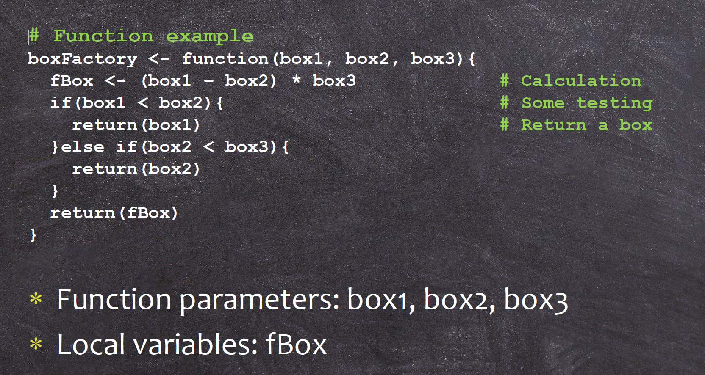
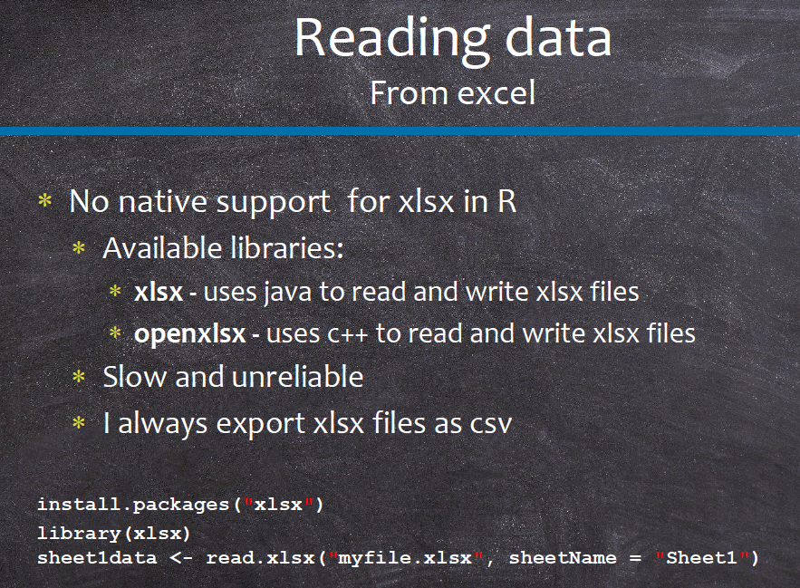
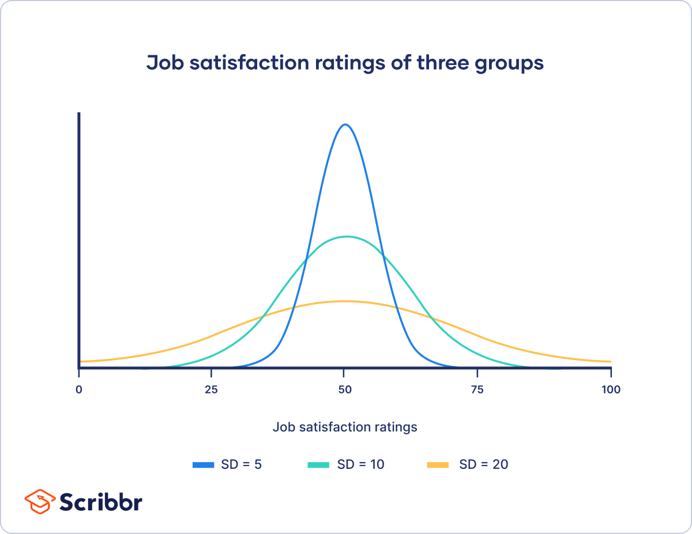
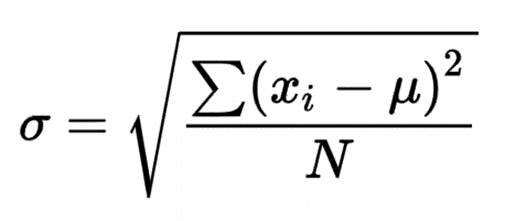
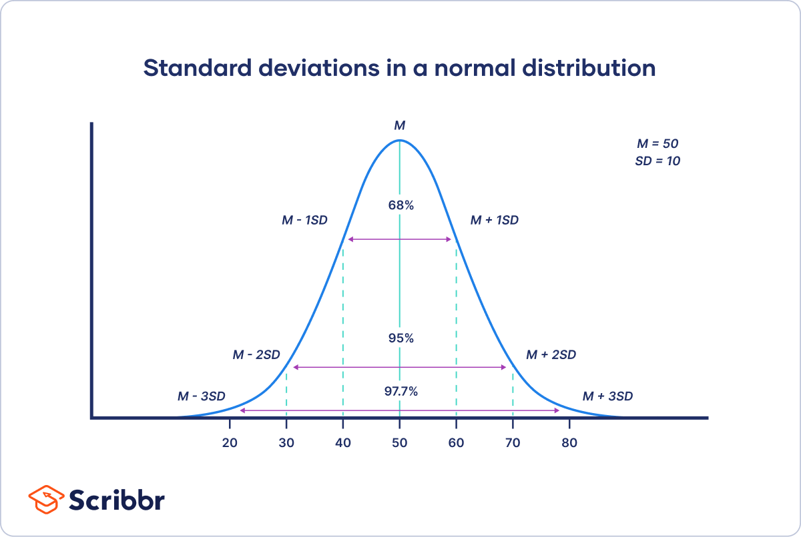

```{r setup, include=FALSE}
knitr::opts_chunk$set(echo = TRUE)
```

## What if you have 20 similar datasets that you need to convert?

### Create a function of conversion



```{r}
exampleFun<-function(p1){
p2 <-p1 * 8 # p1 is still a reference to myvar
p1 <-p2 + 5 # p1 is now a COPY of myvar
return(p1)
}

myvar<-5
exampleFun(myvar)
myvar
```

### your function of conversion here

```{r}
## your code here ##

```

## new merged data: Galldata_Sep11.csv



```{r}

### read data into r (name the object as Alldata)

### take a look at the data structure 

### check the data type 

```

### Q: total number of galls, total number of survivors, GIG, OBT, MC, ELD,BP

```{r}
sum(Alldata$N)
sum(Alldata$survival)

```

### Q: add a column of the total number of parasites (including GIG, OBT, and MC) to the dataset:

```{r}
## your code here
### hint: how to add a column:
Alldata$TPAR<-0

```

### Q: add another column of whether parasites is present or not, assign 1 for presence and 0 for no presence

### Q: Total number of galls, total number of EU (survival), GIG, OBT, MC, ELD,BP, PAR for each site

#### hint: use function colSums

#### hint: use function ddply in package "plyr"

```{r}
ddply(Alldata,c("Site"),summarise,TN=sum(N),EU=sum(survival),GIG=sum(GIG),OBT=sum(OBT),MC=sum(MC),ELD=sum(ELD),BP=sum(BP))

```

## Get a view of what diameter distributions is across all sites

```{r}
### mean, median, and the range of diameters ####
summary(Alldata$Diam)

range(Alldata$Diam) ## minimum and maximum 

quantile(Alldata$Diam) ## get the percentile of the data ###

quantile(Alldata$Diam,c(0.025,0.975)) ## 95% percentile of the data

## get a histogram 
hist(Alldata$Diam)
h<-hist(Alldata$Diam,freq=F)
h
### how to get a histogram with relative frequency as the y axis
str(h)
h$density<-h$counts/sum(h$counts)
plot(h,freq=FALSE)

```

### Quantify the dispersion of the data: standard deviation

 

#### Q: can you calculate the standard deviation of the gall diameter according to the formular?

```{r}
### hint: sqrt() is used to calculate the square root 

```

## Normal distribution (Gaussian distribution): a symmetrical plot of data around its mean value, where the width of the curve is defined by the standard deviation.

### you can define a normal distribution by knowing its mean $\mu$ and standard deviation $\sigma$ 

 

### lots of quantitative traits suit normal distribution: height, weight etc 

