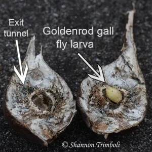
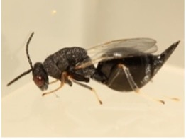
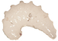
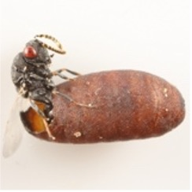
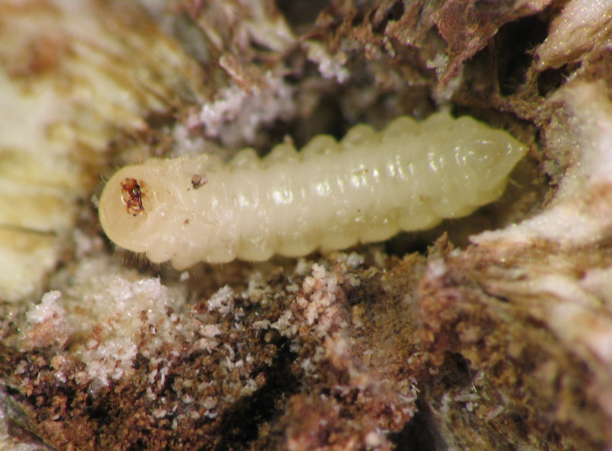
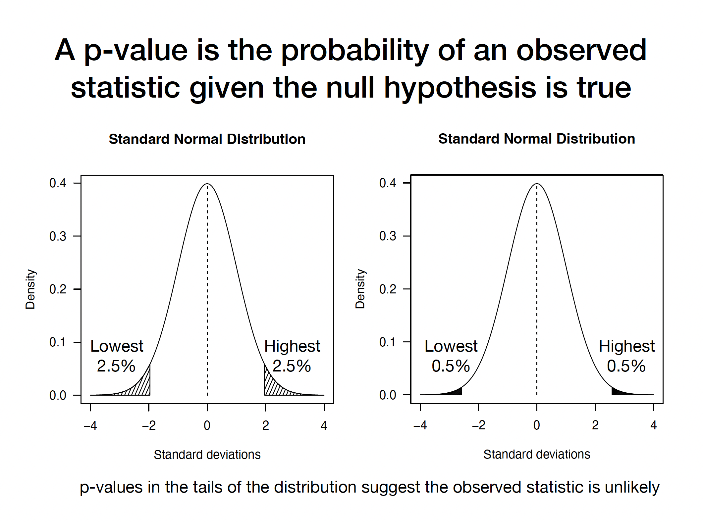

```{r setup, include=FALSE}
knitr::opts_chunk$set(echo = FALSE)
```

### Load the dataset from last lecture

```{r}
Alldata<-read.csv("Galldata_Sep11.csv")
```

### Description of the dataset

-   Each row stands for a gall being dissected and contents were identified and documented.

-   Column "Year" and "Season" indicates the collection year and season of this gall.

-   Column "Site" stands for the initial of the collection sites.

-   Column "Diam" stands for diameter of the gall in mm.

-   Column survival stands for whether a goldenrod gall fly Eurosta (EU) is present (1) or not (0).

{width="196"}

-   Column GIG stands for whether a parasitic wasp Eurytoma gigantea is present (1) or not (0).

{width="158"} {width="158"}

-   Column OBT stands for whether a a parasitic wasp Eurytoma obstusiven is present (1) or not (0).

{width="160"}

-   Column MC stands for whether a tumbling flower beetle Mordellistena convicta is present (1) or not (0).

{width="171"} {width="189"}

-   Column MC stands for whether early death of gall fly Eurosta is present (1) or not (0).

-   Column BP stands for whether bird predation is present (1) or not (0).


### Evidence for stabilizing selection

> > Q: make a histgram of gall size with gall fly presence

```{r}
## your code here
```

> > Q: what's the minimum, maximum, mean, and medium gall size with gall fly presence

```{r}
## your code here
```

> > Q: visualize the range of gall size with gall fly presence use boxplot

```{r}
boxplot()
```

1.  Do parasites attack smaller galls?

```{r}
## your code here
```

2.  Do birds attack bigger galls?

```{r}
## your code here
```

### Frequentist view of hypothesis testing

> How to statistically compare the gall size differences for galls and galls with parasites/birds attack?

> Does gall size differ significantly between survivors and galls attacked by parasites/birds?

 !

-   **Null hypothesis (H~0~)**- no statistical significance (e.g.no difference in gall sizes)

-   **Alternative hypothesis (H~1~)**- statistically significant (one sided hypothesis: parasites attack smaller gall sizes)

-   **Alternative hypothesis (H~2~)**- statistically significant (two sided hypothesis: parasites attack different gall sizes)



> **Q: what is a p-value?**

> a.  the chance of the null hythothesis being right

> b.  the probablity of the hypothesis given the data

> c.  the probability of observing the data

> d.  the probablity of an observed statistic given the null hypothesis is true

#### **Student's t-test: compare difference between two groups**

-   **Null hypothesis**- means of gall sizes are equal for two compared groups
-   **Alternative hypothesis**- means of gall sizes are different for two compared groups

#### How to generate a probability distribution of the null hypothesis?

> #### t statistics

> > **One sample t-test: compare a group of values with a mean**

# $t=\frac{\overline{x}-\mu_{0}}{s/\sqrt{n}}$

> > **Two sample t-test: compare two group of values**

# $t=\frac{\overline{x_{1}}-\overline{x_{2}}}{s_{pooled}}$

# $s_{pooled}=\sqrt{(s_{1}/\sqrt{n_{1}})^2 + (s_{2}/\sqrt{n_{2}})^2}$

> #### Assumption of t-test:

1.  Random samples from the group
2.  Independent observations from two groups
3.  The population of each group is normally distributed
4.  The population variances are equal

> > #### Test of normality

```{r}
## use function: shapiro.test()
```

> > #### Central limit theorem: the distribution of a normalized version of the sample mean converges to a standard normal distribution

> > 

> > > #### conventional wisdom: when sample size \>30, we can apply CLT

> > #### Test of equal variance

```{r}
### using function leveneTest() in package "car" 
```

> > > Non-equal variance: Welch's t-teset (DEFAULT in t.test()) equal variance: t.test(,var.equal=TRUE)

```{r}
?t.test()
# two sample test 
t.test(Alldata$Diam[Alldata$GIG==1],Alldata$Diam[Alldata$GIG==0])

# one sample test 
t.test(Alldata$Diam[Alldata$GIG==1],Alldata$Diam[Alldata$GIG==0],alternative="less")
```

### What if you want to compare whether means are different across multiple groups?

> #### Usually you want to know if applying different treaments (\>3) makes a difference, for instance, does applying fertilizers increases crop productions?

> #### In our gall size data, we can ask if gall sizes are different across different sites

> #### One way anova: an estimate of how much variation in the dependent variable that can be explained by the independent variable.

```{r}
Diamaov<-aov(Diam ~ Site, data = Alldata)
summary(Diamaov)
```

> > Df:Degree of freedom. Maximum number of logically independent values can vary in a data sample.

> > Sum of Squares: total amount of variation explained by Site (between group variation), sum of squares explained by within group variation

> > > Df for factor Site is number of Sites -1 Df for Residuals is number of galls- Df for factor Site -1

> > Mean square: Sum of Squares/Df

> > F value: F statitics. The mean square of each independent variable divided by the mean square of the residuals. The larger the F value, the more likely it is that the variation associated with the independent variable is real and not due to chance.

> > Pr(\>F): p value of the F statistic. This shows how likely it is that the F value calculated from the test would have occurred if the null hypothesis of no difference among group means were true.

### Post-hoc testing: which group of differences are significant from anova test?

```{r}
TukeyHSD(Diamaov)
```

#### one way anova assumptions

> Indepence of observations Normal distribution of the response variable: anova is pretty robust to non-normal distribution Homogeneity of variance: ANOVA’s are considered to be fairly robust against violations of the equal variances assumption as long as each group has the same sample size.

> > Boxplot: A visualization of the Homogeneity of variance across different groups

```{r}
boxplot(Diam ~ Site, data = Alldata)
```

> > what if the variances in unequal among groups

```{r}
oneway.test(Diam ~ Site, data = Alldata,var.equal=FALSE)
```

### Why anova instead of multiple t-tests?

> ##### Type 1 error: False positive, when the null hypothesis is true, but we mistakenly reject it

> ##### Type 2 error: False negative, when the null hypothesis is false, but we failed to reject it

> Q:What is the relationship between P value and type 1 and type 2 error?

> ##### Correction of P values for multiple tests, Bonferroni correction: $\alpha/m$


