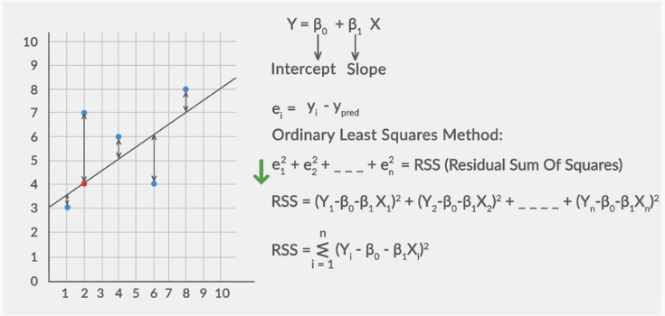
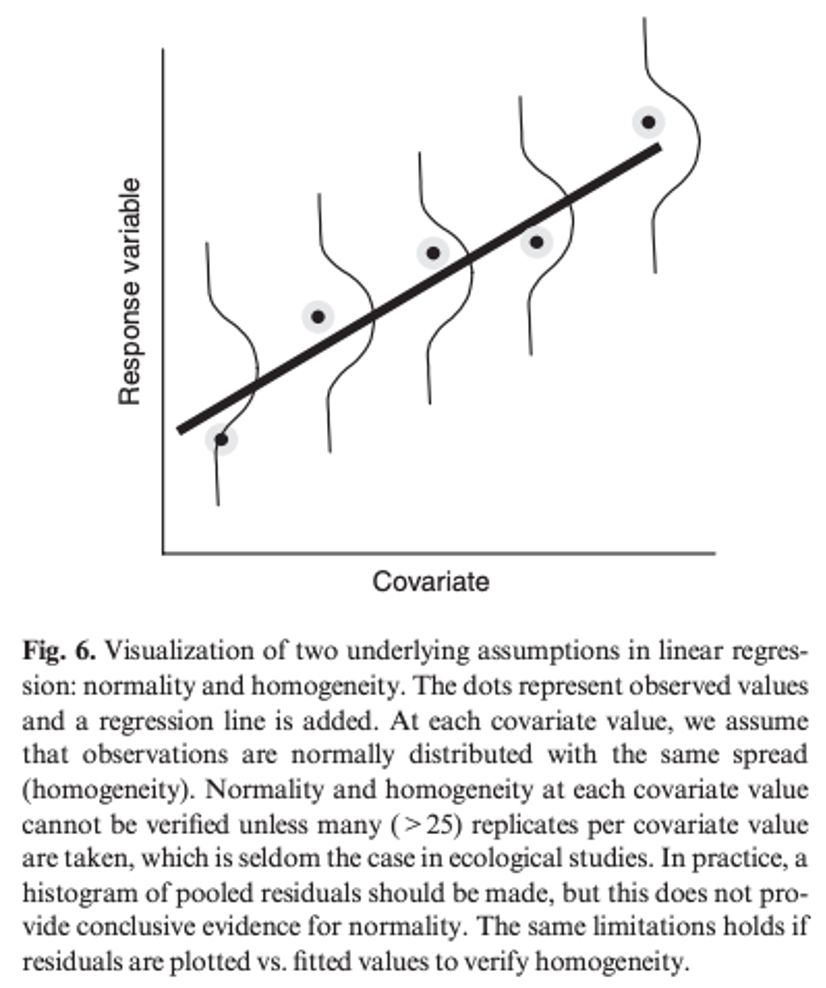

## Read the dataset and load the packages

```{r}
Alldatanew<-read.csv("Alldatanew.csv")
head(Alldatanew)
library(plyr)
```

## Is there a latitudinal gradient of gall sizes?

> ### 1.Visualization of gall size distribution across latitudes

```{r}
boxplot(Diam~Latitude,Alldatanew)

boxplot(Diam~Latitude,Alldatanew[Alldatanew$ELD==0,])

unique(Alldatanew$Latitude)[order(unique(Alldatanew$Latitude))]

unique(Alldatanew$Latitude)[unique(Alldatanew$Latitude)==46.86713]
```

> ### 2.Visualization of average gall size across latitudes

> > #### Q: Calculate the average gall sizes across different sites

```{r}
Alldatanew[Alldatanew$Latitude>46,]
Alldatanew2<-Alldatanew[Alldatanew$ELD==0,]
gallsum<-ddply(Alldatanew2,c("Site","Year","Season","Latitude","longitude","Confidence"),summarize, TN=sum(N),Diam=mean(Diam),EU=sum(survival),GIG=sum(GIG),OBT=sum(OBT),MC=sum(MC),BP=sum(BP))

plot(gallsum$Diam,gallsum$Latitude)

### change labels for x and y axis 
plot(gallsum$Latitude,gallsum$Diam,ylab="Gall diameter (mm)",xlab="Latitude") 
### ylab is for labeling in y axis, and xlab is for labeling in x axis
```

> ### 3. Statistical test of the correlation between gall size and latitude

> > #### Linear regression

```{r}
diamLat.lm1<-lm(Diam~Latitude,data=gallsum)
summary(diamLat.lm1)
```

> > What do estimate coefficients of intercept and latitude mean?

> > > A mathmatical expression of the linear regression: $d_i \sim N(a + \beta l_i,\sigma)$

> > #### Q: what's the mathmatical expression of the fittest linear regression model in diamLat.lm1?

> > #### What does R-squared mean?

> > #### How to calculate the fittest linear model?
> >
> > > Sum of least square 

> > #### Q: What's the null hypothesis in this regression model

> ### Check the assumption of the linear regression

> > 1.  dependent variable normally distributed
> > 2.  errors are normally distributed
> > 3.  errors are homoscendastic
> > 4.  errors are independent of dependent variables



```{r}
par(mfrow=c(2,2))
plot(diamLat.lm1)
```

>> Upper left plot: the model residuals against the model fitted values. 

+ Purpose: checks the linearity assumption of the model 

+ Interpretation: If the residuals are normally distributed then the resulting plot should
look like a straight line relationship, perturbed by some random scatter. Look for a relatively flat red line. If you see a pattern or curve, it might indicate non-linear relationships that the model isn't capturing.


>> Upper right plot: Normal Q-Q (Quantile-Quantile).The standardized residuals are sorted and then plotted against the quantiles of a standard normal distribution. 

+ Purpose: Assesses if the residuals are normally distributed.

+ Interpretation: Points should roughly follow the diagonal line. Significant deviations suggest non-normality in the residuals. The residuals should be evenly scattered above and below zero (the distribution of fitted values is not of interest). 


>> Lower left plot:   scale-location plot. The square root of the absolute value of each standardized residual is plotted against the equivalent fitted value. 

+ Purpose: Checks for homoscedasticity (constant variance) of residuals.

+ Interpretation: Look for a relatively flat red line with points spread equally. A funnel shape might indicate heteroscedasticity.


>> Lower right panel: plot of residuals vs Leverage

+ Purpose: Identifies influential observations or outliers.

+Interpretation: Look for points outside of Cook's distance lines (grey dashed lines). These points may have a large influence on the regression results. Cook’s distance is a measure of how much influence each observation has on the fitted model.A very large value of cook's distance indicates a point that has a substantial influence on the model results. If the Cook’s distance values indicate that model estimates may be very sensitive to just one or two data, then it usually prudent to repeat any analysis without the
offending points, in order to check the robustness of the modelling conclusions. In this case none of the points look wildly out of line


> #### Q: is there violations of linear regression assumptions here? 


### You can also extract residuals and fitted value from the model and make the residual-fitted value plot by yourself

```{r}
plot(diamLat.lm1$fitted.values,diamLat.lm1$residuals)

```

### Pratice question 1: is there a latitudinal trend of sizes of galls that survived? 

### Pratice question 2: is there a latitudinal trend of sizes of galls that attacked by GIG? 

### Pratice question 3: is there a latitudinal trend of sizes of galls that attacked by birds?

