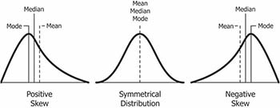
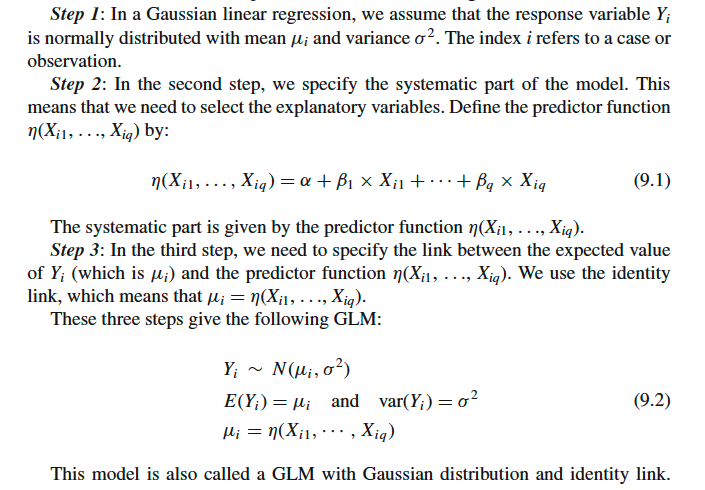
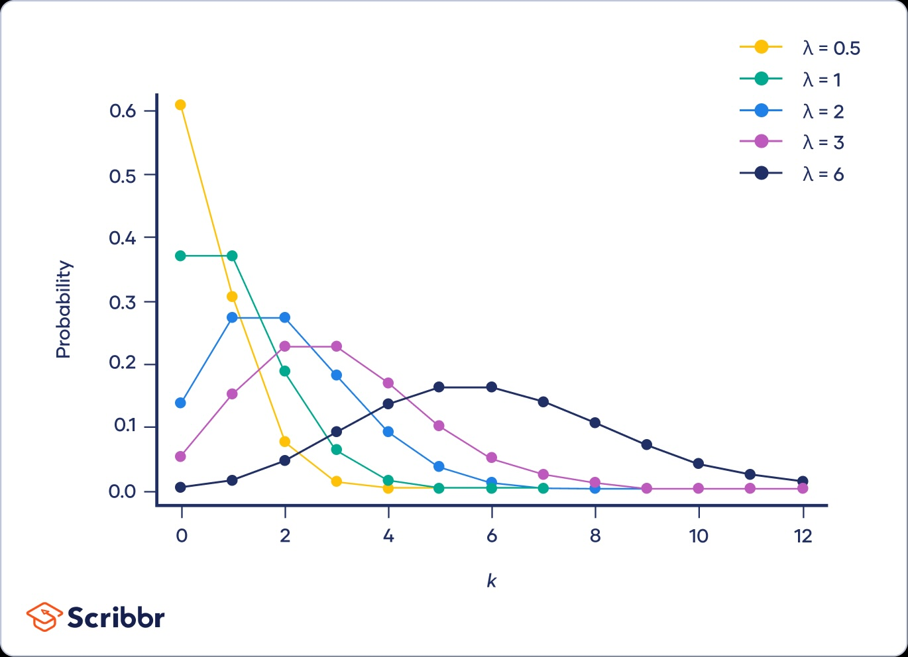
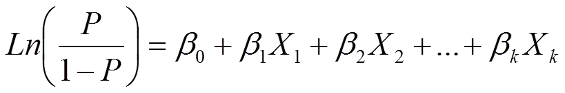

## Last lecture was about Linear mixed model, we talk about including Site as the random effect

> ### Does including Site as the random effect improves the model fit?

> > #### compare model with different fix effects but with the same random structure: must use ML estimators to compare these (nested) models

> > #### compare models with different random structure: must use REML estimators to compare these (nested) models

```{r}
Alldatanew<-read.csv("Alldatanew.csv")
head(Alldatanew)
library(lme4)

diam.lmm1<-lmer(Diam~Latitude+(1|Site),data=Alldatanew,REML=TRUE) 
summary(diam.lmm1)
diam.lmm1<-lmer(Diam~Latitude+(1|Site),data=Alldatanew,REML=FALSE) 
diam.lm<-lm(Diam~Latitude,data=Alldatanew) 
anova(diam.lmm1,diam.lm,refit=FALSE)
```

> ### the formula, Diam \~ Latitude + (1 \| Site), treat Site as a random intercept, what about random slope?

## What's the difference between random intercept and random slope?


# New question: does strength of predation change with latitudinal changes?

> ### Q1: How to quantify the strength of predation?

```{r}
library(plyr)
gallsum<-ddply(Alldatanew,c("Site","Year","Season","Latitude","longitude","Confidence"),summarize, TN=sum(N),Diam=mean(Diam),EU=sum(survival),GIG=sum(GIG),OBT=sum(OBT),MC=sum(MC),BP=sum(BP))

```

> ### Q2: How to test the relationship between the strength of predation and latitude?

```{r}

```

> ### Q3: What should we do when strength of predation is not normally distributed?



> > #### Data transformation:
> >
> > 1.  square-root for moderate skew: sqrt(x) for positively skewed data, sqrt(max(x+1)-x) for negatively skewed data
> > 2.  log for greater skew: log(x) for positively skewed data, log(max(x+1)-x) for negatively skewed data

```{r}

```

> > #### Issues with the non-normal distribution of the response variable in a linear model

-   if y assumes values only over a limited range, then the model y= Xß+ ε does not account for this

-   the model does also not incorporate situations in which the variance is a function of the mean

> > ### Generalized linear model: three steps

1.  An assumption on the distribution of the response variable Yi.This also defines the mean and variance of Yi.
2.  Specification of the systematic part. This is a function of the explanatory variables.
3.  The relationship between the mean value of Yi and the systematic part. This is also called the link between the mean and the systematic part.



## Introduction to common non-normal distributions for observed data

> 1.  poisson distribution: count data

> > E(Y ) = μ, var(Y ) = μ



> 2.  Bernoullis and Binomial Distribution: present/absence or proportional data.

> > **Bernoullis distribution**: probability of getting a value of 0 and 1. E.g. the probablity of getting a head when toss the coin

> > **Binomial distribution**: suppose you know that a coin is fair, and you toss it 20 times. The question is how many heads do you expect? The possible values that you can get are from 0 to 20. Obviously, the most likely value is 10 heads. Using the binomial distribution, we can say how likely it is that you get 0, 1, 2, . . ., 19 or 20 heads.

> > E(Y ) = N × π, var(Y ) = N × π × (1 − π)

### GLM for binomial distribution

> ### link function: logit link



```{r}
PPRD_glm1<-glm(PPRD~Latitude, family=binomial,data=gallsum)
summary(PPRD_glm1)

### plot the regression line between strength of predation and latitude 
Mydata<-data.frame(Latitude=seq(min(gallsum$Latitude),max(gallsum$Latitude),by=1))

Pred<-predict(PPRD_glm1,newdata=Mydata,type="response")
plot(x=gallsum$Latitude,y=gallsum$PPRD)
lines(Mydata$Latitude,Pred)

### check the overdispersion of the distribution 

```


