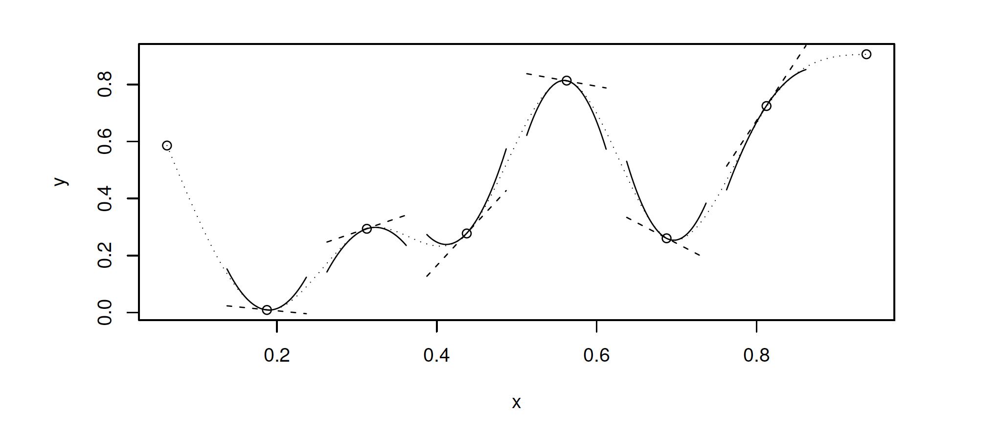

Last lecture, we used GLMM to explore the latitudinal trend of strength of predation

#### GLMM: generalized linear mixed model

> Dataset we should use:

> Response variable:

> Assumed distribution of the response variable:

> Link function:

> Fixed effects:

> Random effects:

> > Compare model with different fix effects but with the same random structure: must use ML estimators to compare these (nested) models

> > Compare models with different random structure: must use REML estimators to compare these (nested) models

```{r}
library(glmmTMB)
library(plyr)
Alldatanew<-read.csv("Alldatanew.csv")
### include a column that mark the presence or absence of predation 

Alldatanew$TPD<-Alldatanew$GIG+Alldatanew$OBT+Alldatanew$MC+Alldatanew$BP

Alldatanew$PD<-1
Alldatanew$PD[Alldatanew$TPD==0]<-0

Alldatanew2<-Alldatanew[Alldatanew$Season=="Fall",]
Alldatanew2<-Alldatanew2[Alldatanew2$Occupant!="ELD",]

PDglmm1<-glmmTMB(PD~Latitude+Diam+(1|Site),family=binomial,data=Alldatanew2)
summary(PDglmm1)

PDglmm2<-glmmTMB(PD~Latitude+(1|Site),family=binomial,data=Alldatanew2)
summary(PDglmm2)

PDglmm3<-glmmTMB(PD~Diam+(1|Site),family=binomial,data=Alldatanew2)
summary(PDglmm3)

PDglmm11<-glmmTMB(PD~Latitude+Diam+(1|Site),family=binomial,data=Alldatanew2,REML=TRUE)
PDglmm12<-glmmTMB(PD~Latitude+Diam,family=binomial,data=Alldatanew2,REML=TRUE)

summary(PDglmm1)
anova(PDglmm1,PDglmm2)
anova(PDglmm1,PDglmm3)
anova(PDglmm11,PDglmm12)
```

> #### model diagnostics
>
> > Introducing DHARMa: residual diagnostics for mixed effect models: <https://cran.r-project.org/web/packages/DHARMa/vignettes/DHARMa.html>

> > Standardized residual (between 0 and 1): 0 means all simulated values are larger than the observed value, and a residual of 0.5 means half of the simulated values are larger than the observed value


```{r}
library(DHARMa)

testDispersion(PDglmm1)

PDglmm1_simres <- simulateResiduals(PDglmm1)
plot(PDglmm1_simres)
plotQQunif(PDglmm1_simres) 
plotResiduals(PDglmm1_simres)
```

### unexplained variance in the probability of predation

{width="772"}

#### non-linear relationship between probability of predation and gall size

#### Generalized additive models (GAM): a generalized linear model with a linear predictor involving a sum of smooth functions of covariates.

> package "mgcv": cubic regression spline: the X gradient (depth) is divided into a certain number of intervals. In each interval, a cubic polynomial (this is a model of the form Yi = α + β1 × Xi + β2 × Xi2 + β3 × Xi3) is fitted, and the fitted values per segment are then glued together to form the smoothing curve. The points where the intervals connect are called knots. To obtain a smooth connection at the knots, certain conditions are imposed. These conditions involve first- and second-order derivates and require high-school mathematics to understand.
 

Find the optimal smoothing function:

**Method one**: select the optimal number of knots and location of knots

**Method two**: fix the number of knots, larger than reasonably needed, find the optimal smoothing parameter: $\lambda$, a "wiggliness" penalty, a larger $\lambda$ penalize the wiggly more.  

Method two, called penalized least squares method, is better: simpler, faster and more robust than method one.  

Obtain the optimal smoothing parameter: Cross-validation

General idea: Observation i is dropped, the smoother is estimated using
the remaining n – 1 observations, the value for observation i is predicted from the estimated smoother, and the difference between the predicted and real value is calculated. This process is then repeated for each observation in turn, resulting in n prediction residuals. As always, residuals are squared and added up, which gives V0.We want to find the smoothing parameter that leads to the smallest V0. 

GCV: generalised cross validation, a modified version of V0 with faster computational process. 

```{r}
library(mgcv)
library(ggplot2)
library(mgcViz)
EU.gam<-gam(survival~s(Diam)+Latitude,data=Alldatanew2,family="binomial")
summary(EU.gam)
EU.gam<-gam(survival~s(Diam),data=Alldatanew2,family="binomial")

summary(EU.gam)
EU.gam_res<-simulateResiduals(EU.gam)
plot(EU.gam_res)

##### k is the number of dimensions, which is number of knots+2, the default is k=10; bs="cr" selection penalized cubic regression splines; the default is to use thin plate regression splines. 
diam_seq<-data.frame(Diam=seq(9,33,0.2))
predict1<-predict(EU.gam,newdata=diam_seq,type="response",se.fit=TRUE)

predict2<-data.frame(Diam = diam_seq$Diam, survival= predict1$fit, se = predict1$se.fit)


EUpool<-ggplot() +
  geom_point(data = Alldatanew2, aes(x = Diam, y = survival)) +
  geom_line(data = predict2, 
            aes(x = Diam, y = survival), color = "blue", size = 1) 
```

What about site variation of the fitness function of gall sizes? 

> How to visualize the fitness function of gall sizes for each individual site? 

